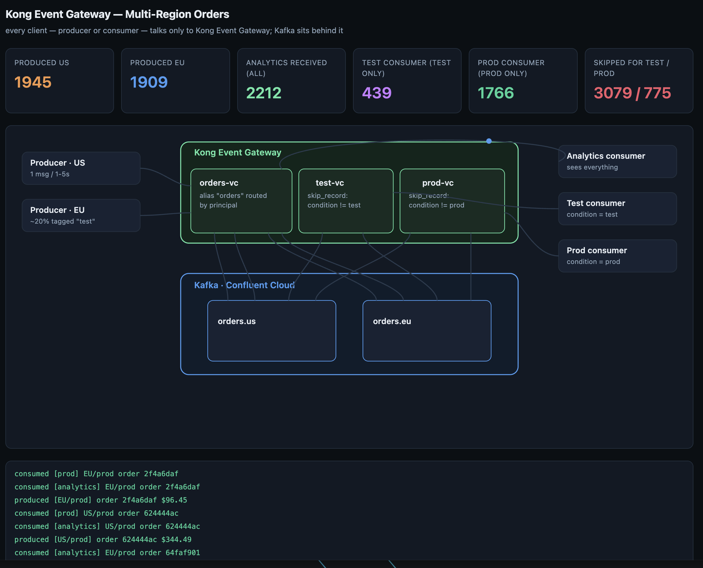
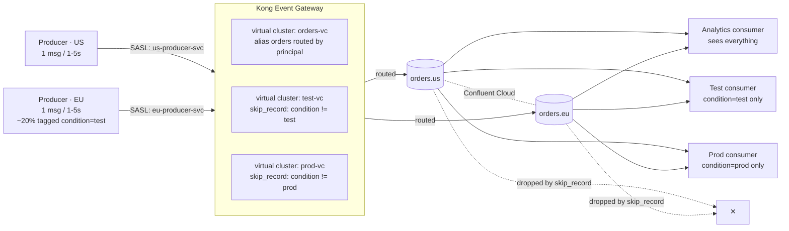

# Kong Event Gateway 簡単なデモ

## 事前準備

### 用意するもの
- Confluent Cloudのアカウント
- docker（ローカルPCで動作）
- konnect アカウント

### 手順

1.Confluent CloudでBasic clusterを作り、Cluster APIKEYとSecretを取得する。
-> .envに必要な情報を書き込む

2.Konnectのアカウントを作り、Konnectのアクセストークン(kpat)を作成する。
-> export KONNECT_TOKEN=<kpat_xxxxxxxxxxxxxxxxxxxx> を実行する。

3.setupを実行
> ./setup.sh 

4.上記完了後以下を実行
> source .venv/bin/activate
> python scripts/dashboard_server.py &
> python scripts/producer.py --region us &
> python scripts/producer.py --region eu &
> python scripts/consumer.py --persona analytics &
> python scripts/consumer.py --persona test &
> python scripts/consumer.py --persona prod &

5.browserで以下に接続
http://127.0.0.1:8090



# Kong Event Gateway Demo — Multi-Region Orders

Two real Kafka problems, solved at the gateway instead of in application code:

1. **Producer → topic routing.** Regional order services publish to one logical
   topic, `orders`. They don't know — and shouldn't need to know — that orders
   physically land in `orders.us` or `orders.eu`. Kong Event Gateway resolves
   that routing transparently, based on *who* is producing (`topic_aliases`
   with a per-principal condition). Add a new region tomorrow and zero
   producer code changes.
2. **Consumer-side data skipping.** Synthetic/canary test traffic is mixed
   into the real order stream at low volume (~20% of orders, tagged
   `condition: test`), a common pattern for continuously exercising
   production infra safely. A production consumer must never process a test
   order (it would corrupt real revenue metrics), and a test/QA consumer only
   cares about test orders (no need to expose it to real customer data, and
   no need to wade through 5x the real traffic to find its own). Both
   consumers subscribe to the exact same two topics — Kong's `skip_record`
   policy on each one's virtual cluster drops the other's records before
   they ever reach that process. Neither consumer contains a line of
   filtering code, and the isolation holds even if a consumer is
   misconfigured to subscribe to the "wrong" topic.

## Architecture



A live version of this diagram is served by `scripts/dashboard_server.py`:
Kong sits on top, Kafka (with its topics) sits beneath it, every client line
terminates at Kong — never at Kafka directly — and each virtual cluster is
drawn as its own box inside Kong. Dots travel client → virtual cluster →
topic (and back) one at a time, flashing the box they land on; a record a
virtual cluster's `skip_record` policy drops animates as a red dot from the
topic to that virtual cluster, flashes it red, and shows "skipped" briefly
at the bottom of that box.

## Backend

- Kafka: an existing Confluent Cloud cluster (bring your own — fill in `.env`).
- Event Gateway: a Konnect-managed control plane + a local Docker data plane.
  `scripts/setup_konnect.py` (called by `setup.sh`) creates the Event Gateway
  itself if it doesn't exist yet, generates/reuses a Konnect data-plane
  client certificate in `kong/dp-certs/`, and starts the
  `orders-event-gateway-dp` container if it isn't already running. This is
  idempotent and safe to re-run any time — in particular after a
  `colima`/Docker restart, which kills the container (it does not survive a
  VM restart) without touching anything already configured in Konnect.

> Note: this directory also contains `scripts/kong-cp-setup.sh` and
> `kong/certs/` — leftovers from an unrelated demo, not used by anything
> here. `kong/dp-certs/` (Konnect data-plane client cert) and
> `kong/listener-certs/` (the demo listener's self-signed TLS cert) are ours,
> generated on first run, and gitignored.

## Running it

```bash
./setup.sh
```

This creates the venv, installs dependencies, creates the two Confluent
Cloud topics, and fully configures the Event Gateway (creating it and its
data-plane container if needed). Re-running it is always safe. Then:

```bash
source .venv/bin/activate
python scripts/dashboard_server.py &
open http://127.0.0.1:8090

python scripts/producer.py --region us &
python scripts/producer.py --region eu &
python scripts/consumer.py --persona analytics &
python scripts/consumer.py --persona test &
python scripts/consumer.py --persona prod &
```

Watch the dashboard: analytics' counter tracks every order produced; the test
consumer's counter only ever climbs on `condition=test` orders and the prod
consumer's only on `condition=prod` orders — each is exactly one skip counter
behind the other's total. "Leaked" stays at 0/0 the whole time, proving
neither consumer ever receives the other's data, even though both subscribe
to the same two topics.

When you're done, stop all producers/consumers with:

```bash
./cleanup.sh
```

(the dashboard server and the Event Gateway data-plane container are left
running — `docker rm -f orders-event-gateway-dp` if you want to stop that too)

## Verifying the routing independently

```bash
# both producers write to "orders" — but land on different physical topics
python -c "
from confluent_kafka.admin import AdminClient
import os, dotenv; dotenv.load_dotenv('.env')
a = AdminClient({'bootstrap.servers': os.environ['BOOTSTRAP_SERVERS'],
                 'security.protocol':'SASL_SSL','sasl.mechanisms':'PLAIN',
                 'sasl.username':os.environ['KAFKA_API_KEY'],'sasl.password':os.environ['KAFKA_API_SECRET']})
print(a.list_topics(timeout=10).topics.keys())
"
```

Or watch either topic directly in the Confluent Cloud console — `orders.us`
only ever contains `"region":"US"` records and `orders.eu` only `"region":"EU"`.
